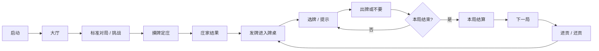
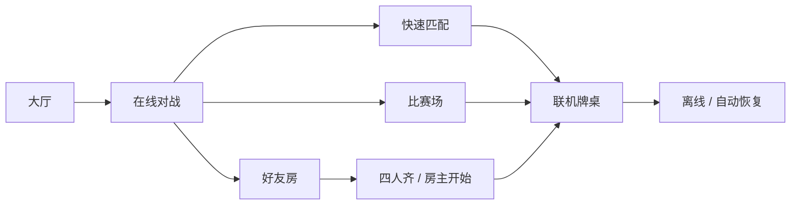
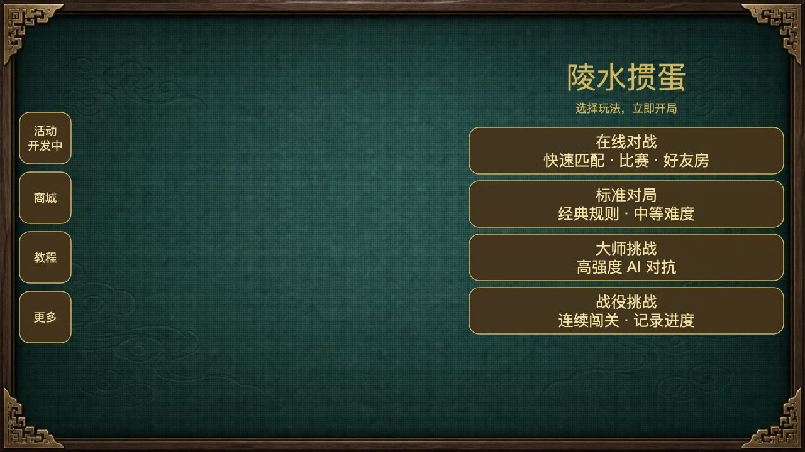
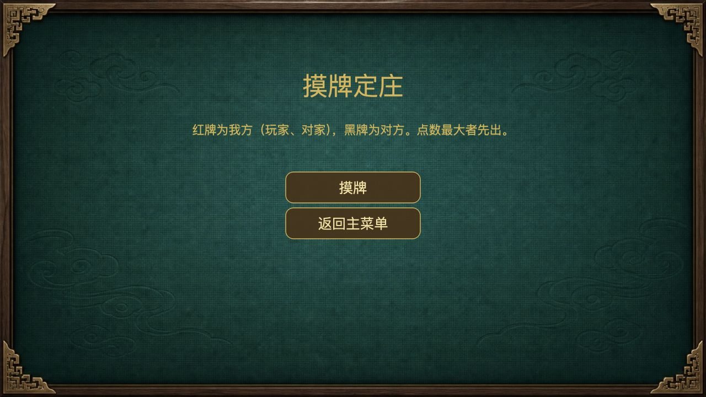
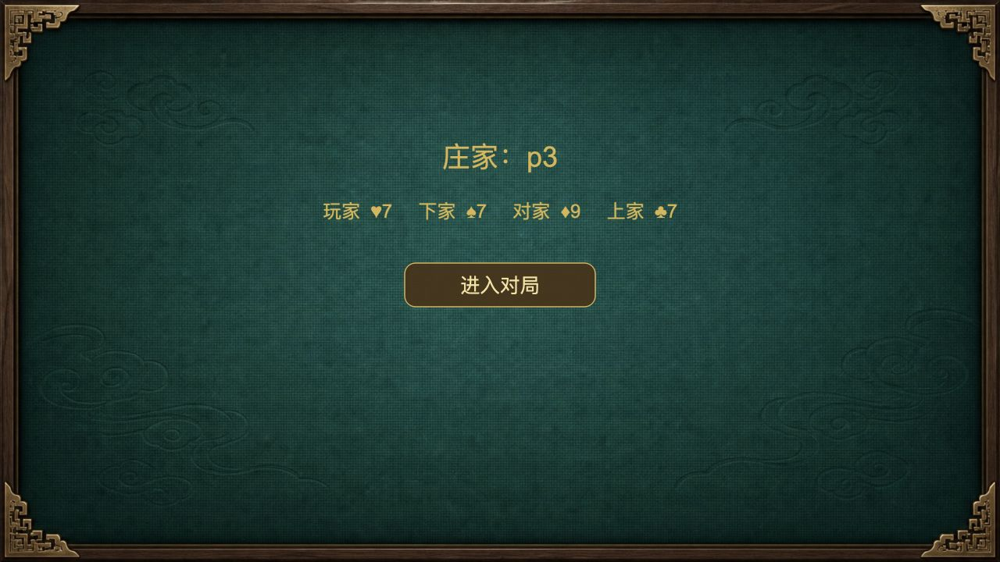
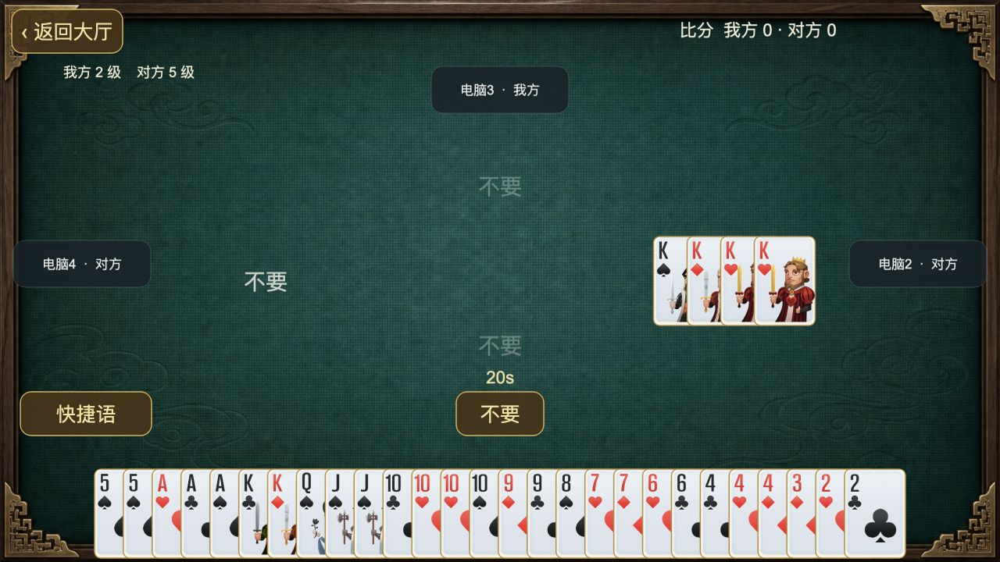
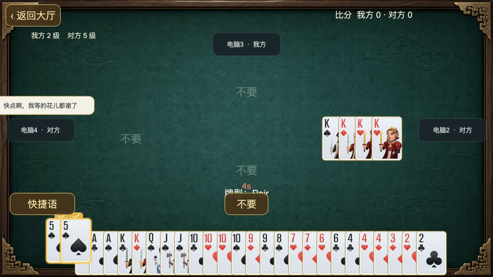
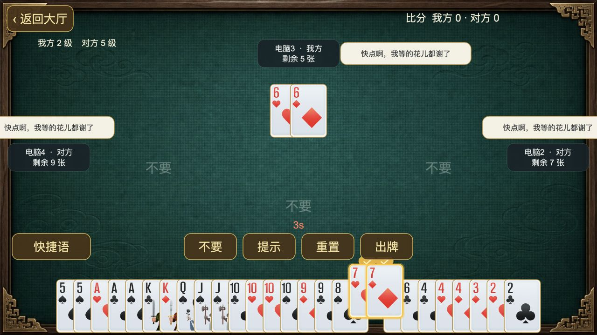
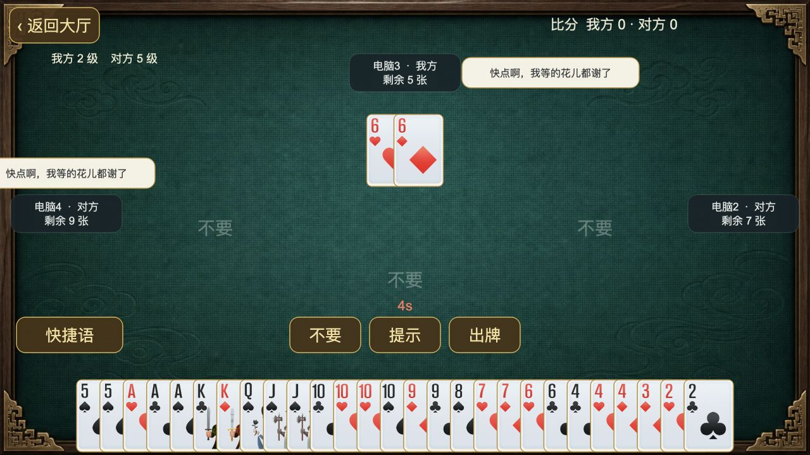
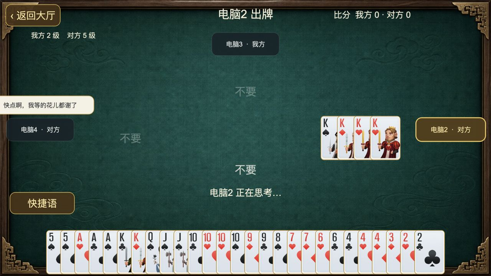

# 陵水掼蛋牌局流程、音效与动效说明

> 文档版本：2026-08-04  
> 对应构建：Web 测试版 `http://127.0.0.1:7488/`  
> 截图规格：1280 × 720  
> 目的：记录当前真实完成度，作为后续补音效、优化动效和人工验收的统一基线。

## 1. 验收口径

本文把三个状态严格分开：

- **已实测**：当前构建中已经通过人工操作看到或听到。
- **源码已配置，待复验**：资源和调用路径存在，但本轮没有通过实际听感或画面验收。
- **待实现**：当前没有专用资源或没有完整表现。

当前已从 MIT 授权的 NiuMa Cocos 工程接入完整且语义明确的 Female 报牌矩阵：全部单张点数、全部普通对子、王对子通用报读，以及三张、顺子、三带二、三连对、同花顺、炸弹和王炸。代码、资源、Cocos `.meta` 与 SHA-256 校验已通过，但本轮没有完成逐项真机听感验收，因此仍标为“源码已配置，待复验”。普通出牌不再叠加电子落牌声；钢板没有专用报型语音，禁止把旧 `feiji.mp3` 误报为钢板。

需要特别区分：

- **通用电子落牌声**：素材仍作为其他事件的末级兼容资源保留，但真实出牌链路不再播放，避免覆盖人声报牌。
- **牌面报读语音**：例如“对五”“顺子”等可辨识语音。
- **牌型事件音效**：例如炸弹爆破声、同花顺强调声，不一定包含人声报型。

## 2. 当前牌型音效与动效覆盖

| 牌型 | 当前音频实现 | 当前动效实现 | 本轮状态 |
| --- | --- | --- | --- |
| 单张 | `2–10、J、Q、K、A、小王、大王` 完整 NiuMa Female 报牌；不叠加电子落牌声 | 260ms 弧线飞牌、落地光环、轻震动 | 源码已配置，待逐项听测 |
| 对子 | `2–10、J、Q、K、A` 完整 NiuMa Female 报牌；大小王对子使用语义明确的通用“对子”，更具体的“对小王”仍优先；不叠加电子落牌声 | 280ms 飞牌、“对子”标签、横向流光、轻震动 | 源码已配置，待逐项听测 |
| 三张 | NiuMa MIT 女声“三张”，不叠加电子落牌声 | 飞牌、“三张”标签、通用流光 | 待听感复验 |
| 顺子 | NiuMa MIT 女声“顺子”，原授权语音为后备；不叠加电子落牌声 | 飞牌、“顺子”标签、通用流光 | 待听感复验 |
| 三带二 | NiuMa MIT 女声“三带二”，不叠加电子落牌声 | 飞牌、“三带二”标签、通用流光 | 待听感复验 |
| 三连对 | NiuMa MIT 女声“三连对”，不叠加电子落牌声 | 飞牌、“三连对”标签、通用流光 | 待听感复验 |
| 钢板 | 暂无专用报型语音，也不播放电子落牌声 | 飞牌、“钢板”标签、通用流光 | 音频待补 |
| 同花顺 | 事件强调声 + NiuMa MIT 女声“同花顺”报型 | 320ms 飞牌、暗场、海蓝流光、中央标题、中震屏、中震动，约 900ms | 待实机复验 |
| 炸弹 | 授权炸弹事件音效 + NiuMa MIT 女声“炸弹”报型 | 4–5 张小炸、6–7 张中炸、8 张以上大炸；火焰、烟雾、标题与分级震屏 | 待实机复验 |
| 天王炸／四王炸 | 临时 `king_bomb.wav` 事件声 + NiuMa MIT 女声“王炸”报型 | 暗场、金色标题、火花、强震屏、重震动，约 1050ms | 待实机复验 |
| 不要 | NiuMa MIT 三种女声“不要”按轮次轮换，授权“过”语音为后备 | 只显示“不要”文字，淡入淡出，不放入纸牌框 | 源码已配置，待三种变体听测 |

规则要求四张王同时组成最高牌型，因此文档统一称为**天王炸／四王炸**，不使用斗地主的“火箭”称呼。

## 3. 牌局流程

联机分支：

当前 Web 构建没有配置 `lobbyEndpoint` 和 `platformEndpoint`，因此只能自然复现单机牌局；快速匹配会提示开发中，好友房会显示接口未配置提示。

## 4. 各流程节点的声音与画面规格

| 流程节点 | 当前声音 | 当前画面／动效 | 下一步建议 |
| --- | --- | --- | --- |
| 大厅 | 无背景音乐 | 陵水主题背景；左侧活动/商城小图标，右侧大玩法入口 | 后续仅补低存在感环境音乐，不要抢牌局语音 |
| 匹配 | 无 | 三张代码绘制的牌循环洗牌 | 增加进入匹配、匹配成功和失败三种短音效 |
| 摸牌定庄 | 无 | 说明文字淡入，点击后显示庄家结果 | 补摸牌、翻牌、定庄确认；动画总时长控制在 1 秒内 |
| 发牌 | NiuMa “本局开始”提示后 450ms 触发原授权发牌音；本地开局、下一局和联机新局使用同一语义入口 | 手牌从下方淡入、缩放并错峰出现 | 真机确认两层声音不互相遮蔽；后续可升级为四方位真实发牌 |
| 选牌 | 无 | 牌面位置与层级保持稳定，仅使用边框和压暗滤镜标注；支持点按与连续拖选 | 可加极轻点击声；连续拖选时需限频 |
| 提示 | 无 | 自动选中一组合法牌；恒常操作栏不因选牌状态增删按钮 | 可加短促提示声，不能和报牌语音混淆 |
| 普通出牌 | 只播放可识别的人声报牌，不叠加电子落牌声 | 临时克隆牌弧线飞向桌面，正式桌面牌先显示 | 真机确认人声清晰且连续出牌不串音 |
| 不要 | 三种 NiuMa Female 语音按轮次轮换；授权“过”作为后备 | 仅文字淡入淡出 | 真机确认每次仅播一次且三种节奏自然 |
| 倒计时 | 最后 5 秒精确使用 `warning5` 至 `warning1`；`warning0` 已保留供超时事件使用 | 默认 20 秒，最后 5 秒变红 | 真机确认顺序、响度和一秒间隔 |
| 逢人配 | 本地临时 `wildcard.wav` | 金色“逢人配”标签叠加原牌型效果 | 仅在实际作为万能牌使用时触发；旧网络快照需兼容字段 |
| 对手剩余十张 | 无 | 从大于 10 张降至不超过 10 张时提示 1.6 秒，随后持续显示数量 | 剩 2 张时增加更明确但不过度刺耳的警示 |
| 玩家出完 | 无 | “已出完 · 头游/二游…”提示 1.6 秒 | 增加轻量完成音，不覆盖下一家出牌声 |
| 胜利 | NiuMa MIT 胜利音，原 `win.wav` 为后备 | 金色粒子、标题、“胜利 · 升 N 级”、中震动 | 真机校准约 3.3 秒尾音与结算动画节奏 |
| 失败 | 授权失败音优先，NiuMa MIT 失败音为后备 | 灰色标题“本局结束” | 实机校准响度，避免约 4.9 秒声音过度负面 |
| 进贡／还贡 | 无专用音效 | 主要依赖结算遮罩和选牌反馈 | 补贡牌飞行、抗贡、阶段完成三个反馈 |
| 离线／恢复 | 无 | 头像旁显示“离线”；恢复后“已恢复”显示 1.5 秒 | 建议保持无声；历史牌型特效不重放 |

## 5. 截图材料

### 5.1 大厅与入口

图 1：大厅稳定画面。左侧是活动与商城入口，右侧是主要玩法入口；该画面用于说明局外层级和牌局入口。

### 5.2 摸牌定庄

图 2：摸牌定庄说明页。当前只有文字和按钮，尚无专用声音及真实翻牌过程。

图 3：摸牌完成后的庄家结果。建议后续在该节点加入一次明确的定庄确认反馈。

### 5.3 牌桌与信息分布

图 4：完整牌桌。左上角依次为“返回大厅”和双方级数；上方队友信息固定在独立区域。底部状态栏按“左侧快捷语/聊天、中间倒计时、右侧牌型提示”分区，操作按钮单独位于下一行，避免与桌面“不要”文字及手牌重叠。

### 5.4 选牌反馈

图 5：手牌选中后保持原位置和绘制层级，仅显示边框与压暗滤镜。该画面用于验收点按、滑动连续选择和锁牌反馈。

图 6：点击“提示”后自动选中可出的对子；“提示 / 不要 / 出牌”等恒常操作不由选牌状态决定是否出现。

### 5.5 跟牌与不要

图 7：跟牌回合。桌面中央显示上一手牌，底部操作区自然承担“轮到你”的提示，不再额外显示文字。

图 8：“不要”只显示文字，不套用纸牌框。音频应播放一次 NiuMa Female“不要”变体；授权“过”仅作资源缺失时的后备。

## 6. 动效调度原则

- L0 普通出牌：飞牌、落地光环和轻触感，可并行。
- L1 组合牌型：短标签和扫光，不使用大面积暗场。
- L2 炸弹：同一时间最多一个主特效；新主特效可替换较低级效果。
- L3 同花顺、天王炸、大炸弹：稀缺使用暗场、标题和震屏。
- 震屏只作用于牌桌容器，不晃动返回大厅、聊天和弹窗。
- 正式桌面牌尽早显示，装饰动画可以继续播放；特效不阻塞规则计算和网络消息。
- “跳过动画”直接进入最终画面；重连和状态恢复不重放历史大特效。
- “精简／关闭”只降级视觉；音效由独立声音设置控制。

## 7. 已知高优先级问题

### 已修复、待四端实测：联机增量与恢复表现

`NetworkEffectSyncPolicy` 已将权威状态包区分为增量、恢复和丢弃三类：

- 首次进入、断线重连、版本缺口和跨局重置只建立静默恢复基线，不补播历史效果。
- 连续版本且恰好增加一个动作时，飞牌、牌型报读和对应主特效只播放一次。
- 重复或旧版本包直接丢弃，不清除刚产生的本地选牌，也不重复播放声音。
- 正式桌面状态优先更新，表现动画不阻塞规则、输入或网络消息。

`tests/network-effects-regression.cjs` 已覆盖初始快照、连续增量、重复包、版本缺口和跨局首动作。自动测试已通过，仍需四个独立会话在真实 WebSocket 链路上复验。

### P1：声音资源存在不等于已经验收

- 完整 Female 报牌矩阵、三种“不要”、倒计时和局流程资源已通过哈希与路由测试，但本轮没有完成稳定实际听感验收。
- 天王炸的事件音效和逢人配仍使用临时本地音效；王炸另有 NiuMa 女声报型。
- 已接入一条 MIT 授权的 30.5 秒默认背景音乐并补齐独立循环声道、开关和音量控制；仍需真机听测循环接缝、响度及前后台恢复。
- 授权 CDN 的 `pair_a_phrase.mp3` 与已被替代的 `straight_flush.mp3` 只保留在 `art-source/audio/licensed-archive`，不会进入运行时资源包；对 A 和同花顺均使用语义明确的 NiuMa 语音。
- `feiji.mp3`、`yapai.mp3` 与 `dealcard.ogg` 已在 NiuMa 清单中记录为排除项，不进入运行时。

### P1：特殊牌型画面无法稳定采集

当前没有效果预览页、固定牌局种子或浏览器调试入口；洗牌使用 `Math.random()`。逢人配、大炸弹、同花顺、天王炸、指定结算等状态难以靠自然牌局稳定复现。

建议新增一个**只在开发构建启用**的“牌局效果预览器”，使用固定 fixture 触发每种牌型、结算和贡还流程。它既能批量截图，也能成为音效与动效回归测试入口，不进入正式发行包。

## 8. 人工验收清单

### 音频

- [ ] 用耳机和手机扬声器分别测试，确保报牌语音清晰、爆炸声不过载。
- [ ] 逐一验证 15 种单张、13 种普通对子和大小王对子；逢人配替代点数时不得误报实体级牌。
- [ ] 顺子、同花顺、炸弹、天王炸分别至少触发 3 次，记录是否每次播放、是否重复、是否被截断。
- [ ] 连续快速出牌时不得出现电子落牌声；相邻玩家的人声报牌不能互相吞掉。
- [ ] 连续三次“不要”依次听到三个变体且每次只播放一次；倒计时按 5、4、3、2、1 顺序且间隔均匀。
- [ ] 新局确认先播放“本局开始”，约 450ms 后进入发牌声；快速离桌或关闭声音后不得出现延迟残音。
- [ ] 关闭音效后所有效果静音；仅关闭视觉特效时声音仍正常。

### 动效

- [ ] 四个方位出牌都从正确起点飞向正确桌面位置。
- [ ] 自己选牌上移、取消选择复位，AI 出牌后仍可继续响应。
- [ ] 无牌可压时只显示居中的“不要”。
- [ ] 普通牌型标签不遮挡桌面牌；L2/L3 主特效不遮挡必要按钮超过 1 秒。
- [ ] 炸弹震动只作用于牌桌，不晃动顶部导航和弹窗。
- [ ] 玩家出完与剩余十张提示不互相覆盖。
- [ ] 断线恢复直接显示最终状态，不重放历史飞牌和大特效。

### 联机

- [ ] 四个独立会话进入同一房间，轮流出单张、对子、不要与炸弹。
- [ ] 其他三端都能看到飞牌、听到对应声音，且每个动作只触发一次。
- [ ] 一端断网后其余客户端显示“离线”；恢复后 1.5 秒内显示“已恢复”。
- [ ] 重连不会重放断线期间所有历史音效和特效。

## 9. 推荐执行顺序

1. 用四个独立会话复验已完成的增量/恢复策略，覆盖重复包、乱序包、版本缺口和跨局首动作。
2. 建立开发态效果预览器和固定牌局 fixture，先解决“无法稳定复现”。
3. 真机逐项复验完整 Female 报牌矩阵、三种“不要”、倒计时和局开始/胜负声音；继续单独制作“钢板”语音。
4. 替换逢人配和天王炸的临时事件音效；不要用 `feiji.mp3` 代替钢板。
5. 用真机做扬声器、蓝牙耳机、弱网与低性能设备验收，再决定是否加入背景音乐。

## 10. 源码索引

- 牌面报读：`assets/scripts/audio/PlayVoiceProfiles.ts`
- 语义音频配置：`assets/scripts/audio/AudioProfiles.ts`
- 牌型报读配置：`assets/scripts/audio/PlayVoiceProfiles.ts`
- NiuMa 音频来源清单：`third_party/licenses/niuma-client-cocos-audio.json`
- NiuMa 接入范围与排除项：`docs/niuma-audio-import.md`
- 音效与动效统一调度：`assets/scripts/effects/EffectController.ts`
- 牌型表现分级：`assets/scripts/effects/EffectProfileResolver.ts`
- 出牌飞行：`assets/scripts/effects/CardFlightController.ts`
- 选牌动画：`assets/scripts/ui/CardView.ts`
- 桌面牌与“不要”：`assets/scripts/ui/PlayAreaController.ts`
- 倒计时、出完牌与剩余张数提示：`assets/scripts/scenes/GameScene.ts`
- 匹配和摸牌定庄：`assets/scripts/scenes/FrontPageController.ts`
